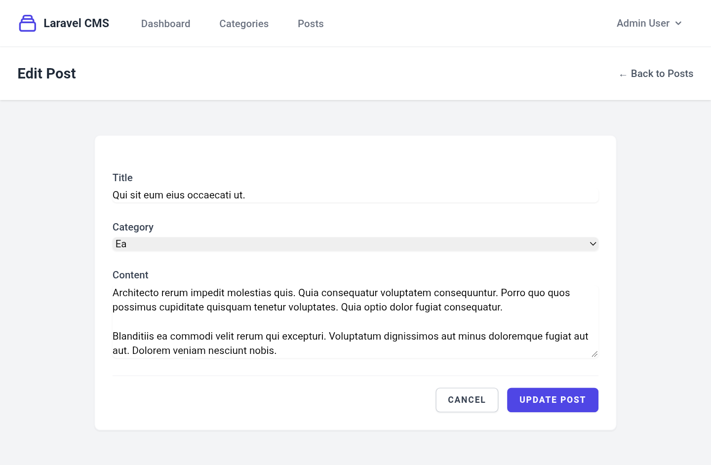

# 🚀 Role-Based Laravel 13 CMS

A lightweight Content Management System (CMS) built with **Laravel 13**, **Blade**, **Eloquent ORM**, and **Tailwind CSS**. Features role-based access control (RBAC), custom middleware, seeded database models, and dynamic management of categories and posts.

## ✨ Features

* **Role-Based Access Control (RBAC):** Admin-only CRUD operations enforced via custom `IsAdminMiddleware`.
* **Authentication:** Built-in authentication powered by Laravel Breeze.
* **Content Management:** Create, read, update, and delete categories and posts with database relationships.
* **Database Architecture:** Seeders configured with `firstOrCreate` to maintain predictable seed data without duplication across migration refreshes.
* **Modern UI:** Styled using Tailwind CSS compiled via Vite.

## 🛠️ Tech Stack

* **Framework:** Laravel 13
* **Templating:** Blade
* **Database:** PostgreSQL
* **Authentication & Security:** Laravel Breeze & Custom Middleware
* **Frontend Styling:** Tailwind CSS & Vite
* **Development Tools:** Artisan Tinker, Model Factories & Seeders

## 📸 Screenshots

### Homepage


### Admin Dashboard


### Posts Management


### Edit Post Form


## 📋 Prerequisites

Ensure your development environment meets the following requirements before setting up the application:

* **PHP:** `^8.3` (Your environment: `8.5+`)
* **Composer:** `^2.0`
* **Node.js & npm:** Node `18+` / npm `9+`
* **PostgreSQL:** `14+`

## ⚙️ Installation & Local Setup

Follow these steps to run the application locally:

### 1. Clone the Repository

```bash
git clone https://github.com/nikhil-kumar-swe/laravel-cms.git
cd laravel-cms
```

### 2. Install Dependencies

```bash
composer install
npm install
```

### 3. Environment Configuration

Copy the environment template and generate an application key:

```bash
cp .env.example .env
php artisan key:generate
```

### 4. Database Setup (PostgreSQL)

Ensure your PostgreSQL server is running, then create a new database before running migrations:

* **Using `psql` CLI:**
  ```sql
  CREATE DATABASE laravel_cms;
  ```

* **Or via pgAdmin / GUI client:** Create a database named `laravel_cms`.

Update your `.env` file with your local PostgreSQL credentials:
```env
DB_CONNECTION=pgsql
DB_HOST=127.0.0.1
DB_PORT=5432
DB_DATABASE=laravel_cms
DB_USERNAME=your_postgres_username
DB_PASSWORD=your_postgres_password
```

### 5. Run Migrations & Database Seeders

Once the database is created and `.env` credentials are set, execute:

```bash
php artisan migrate --seed
```

### 6. Frontend Assets & Server Setup

Depending on whether you are actively developing or previewing production assets, run one of the following options:

* **Option A: For Active Local Development (Live Hot-Reloading for Tailwind/JS changes)**
  ```bash
  # Terminal 1: Run Vite dev server for live styling changes
  npm run dev
  
  # Terminal 2: Run Laravel backend server
  php artisan serve
  ```

* **Option B: For Production Asset Compilation**
  ```bash
  npm run build
  php artisan serve
  ```

Access the application at `http://127.0.0.1:8000`.

## 🔑 Default Credentials

When running `php artisan db:seed`, default accounts are generated for testing:

* **Admin User (Full Access):**
  * **Email:** `admin@example.com`
  * **Password:** `password`

* **Standard User (Restricted Access):**
  * **Email:** `user@example.com`
  * **Password:** `password`
